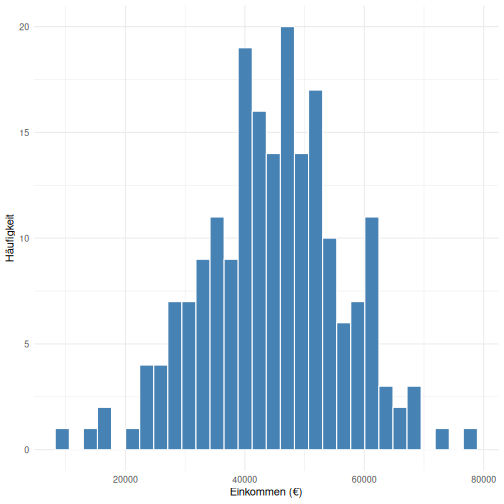
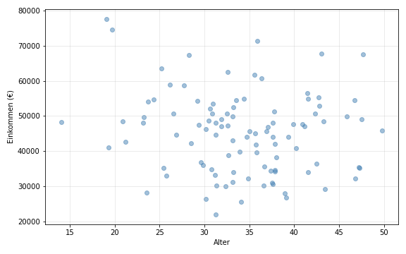

## Forschungsdesign

Diese Studie verwendet ein quantitatives Forschungsdesign...

Inline-Code: Der p-Wert beträgt 0.001 und ist somit signifikant.

## Datenerhebung

Die Daten wurden erhoben durch...

## Datenanalyse

Zur Analyse wurden folgende Methoden angewendet:

### R-Code (sichtbar)


```r
library(tidyverse)
```

```
## ── Attaching core tidyverse packages ──────────────────────── tidyverse 2.0.0 ──
## ✔ dplyr     1.1.4     ✔ readr     2.1.5
## ✔ forcats   1.0.0     ✔ stringr   1.5.1
## ✔ ggplot2   3.4.4     ✔ tibble    3.2.1
## ✔ lubridate 1.9.3     ✔ tidyr     1.3.1
## ✔ purrr     1.0.2     
## ── Conflicts ────────────────────────────────────────── tidyverse_conflicts() ──
## ✖ dplyr::filter() masks stats::filter()
## ✖ dplyr::lag()    masks stats::lag()
## ℹ Use the conflicted package (<http://conflicted.r-lib.org/>) to force all conflicts to become errors
```

```r
data <- tibble(
  variable = c("Alter", "Einkommen", "Bildungsjahre"),
  mean = c(35.2, 45600, 14.3),
  sd = c(8.4, 12500, 2.1),
  n = c(250, 250, 250)
)

knitr::kable(data, 
             caption = "Deskriptive Statistik",
             digits = 1)
```


Table: Deskriptive Statistik

|variable      |    mean|      sd|   n|
|:-------------|-------:|-------:|---:|
|Alter         |    35.2|     8.4| 250|
|Einkommen     | 45600.0| 12500.0| 250|
|Bildungsjahre |    14.3|     2.1| 250|

Siehe @tbl-r-example für die deskriptiven Statistiken.

### R-Code (unsichtbar, nur Output)



Die Verteilung der Einkommen ist in @fig-r-plot dargestellt.

### Python-Code (sichtbar)


```python
import pandas as pd
import numpy as np

np.random.seed(42)
df = pd.DataFrame({
    'Alter': np.random.normal(35, 8, 100),
    'Einkommen': np.random.normal(45000, 12000, 100),
    'Bildung': np.random.normal(14, 2, 100)
})

corr = df.corr().round(2)
print(corr)
```

```
##            Alter  Einkommen  Bildung
## Alter       1.00      -0.14     0.19
## Einkommen  -0.14       1.00    -0.04
## Bildung     0.19      -0.04     1.00
```

Die Korrelationen werden im Code-Output ausgegeben.

### Python-Code (unsichtbar)



@fig-python-plot zeigt den Zusammenhang zwischen Alter und Einkommen.
