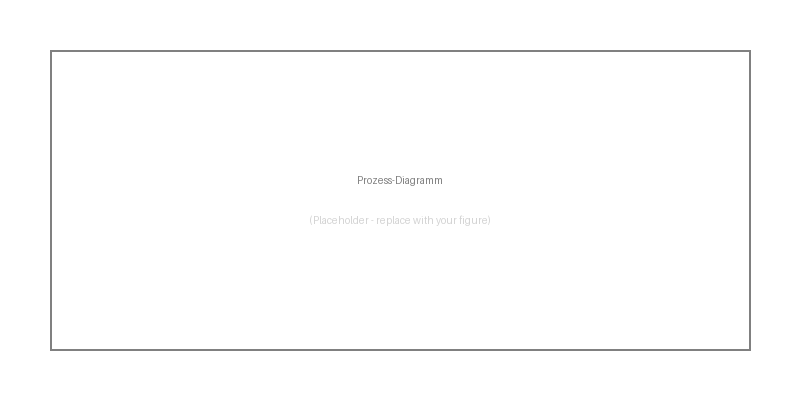

## Deskriptive Statistik

Die deskriptiven Ergebnisse zeigen, dass die Stichprobe repräsentativ ist (siehe @tbl-r-example).

## Externe Abbildung

Die Prozessvisualisierung in @fig-process zeigt den Ablauf der Datenerhebung.

{#fig-process width="80%"}

## Hypothesentests

Die Ergebnisse der Hypothesentests sind in @tbl-hypothesen dargestellt.

| Hypothese | p-Wert | Effektstärke | Ergebnis |
|-----------|--------|--------------|----------|
| H1: Alter → Einkommen | 0.001 | 0.45 | Bestätigt |
| H2: Bildung → Einkommen | 0.023 | 0.32 | Bestätigt |
| H3: Geschlecht → Einkommen | 0.187 | 0.08 | Abgelehnt |

: Ergebnisse der Hypothesentests {#tbl-hypothesen}

@tbl-hypothesen zeigt, dass H1 und H2 bestätigt werden können (p < .05), während H3 abgelehnt werden muss.

## Regressionsanalyse

### R-Code mit Tabelle

```{r}
#| label: tbl-regression
#| tbl-cap: "Regressionsanalyse: Prädiktoren des Einkommens"

library(broom)

# Simulierte Regression
set.seed(42)
n <- 200
age <- rnorm(n, 35, 8)
education <- rnorm(n, 14, 2)
income <- 20000 + 800 * age + 1500 * education + rnorm(n, 0, 8000)

model <- lm(income ~ age + education)
tidy_model <- broom::tidy(model)

knitr::kable(tidy_model, 
             digits = 3,
             col.names = c("Prädiktor", "b", "SE", "t", "p"))
```

Die Regressionsergebnisse in @tbl-regression bestätigen die Hypothesen.

### Python-Code mit Abbildung

```{python}
#| label: fig-residuals
#| fig-cap: "Residuenanalyse der Regression"
#| echo: true

import numpy as np
import matplotlib.pyplot as plt
from scipy import stats

np.random.seed(42)
residuals = np.random.normal(0, 1, 100)

fig, axes = plt.subplots(1, 2, figsize=(10, 4))

axes[0].hist(residuals, bins=20, edgecolor='white', color='steelblue')
axes[0].set_title('Histogramm der Residuen')
axes[0].set_xlabel('Residuen')

_ = stats.probplot(residuals, dist="norm", plot=axes[1])
axes[1].set_title('Q-Q-Plot')

plt.tight_layout()
plt.show()
```

Die Residuenanalyse in @fig-residuals zeigt keine Verletzungen der Annahmen.
